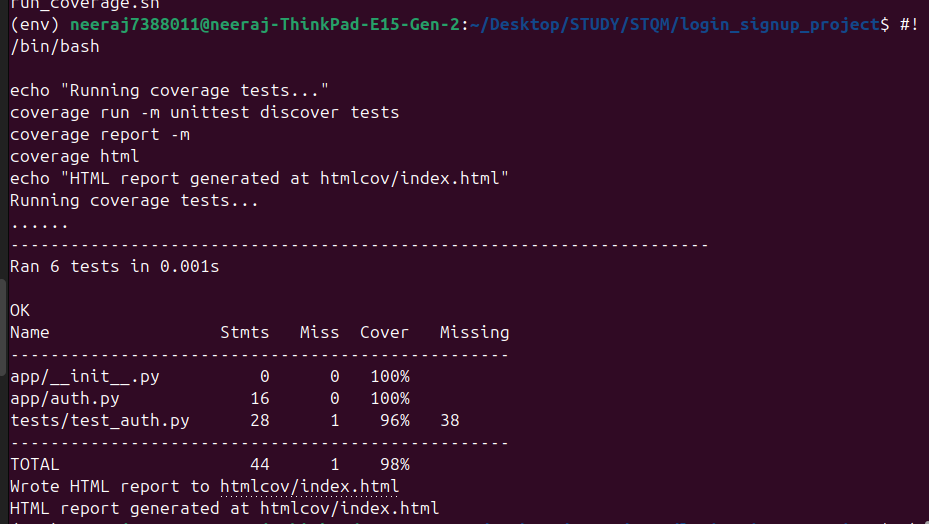
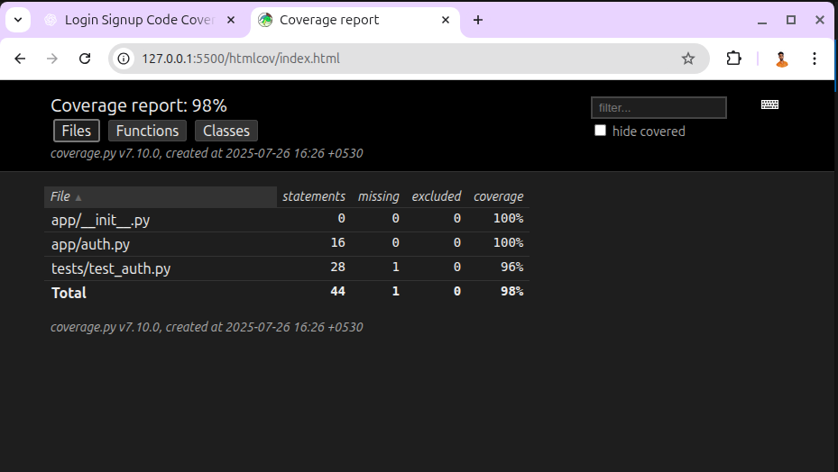

# 🔐 Login & Signup System – Code Coverage Tested ✅

A minimal yet powerful Python-based Login & Signup authentication system backed by unit testing and 100% code coverage using `unittest` and `coverage.py`.


---

## 📌 Features

- 🔐 **Signup & Login** functionalities
- 📏 Password strength validation
- ✅ Unit tested with `unittest`
- 📊 Code coverage reporting via `coverage.py`
- ⚙️ Simple project structure and clean codebase
- 📁 Auto-generated HTML coverage report

---

## 🗂️ Project Structure

```
login_signup_project/
├── app/
│   ├── auth.py         # Login & Signup core logic
│   └── __init__.py
├── tests/
│   ├── test_auth.py    # Unit tests for the auth system
│   └── __init__.py
├── run_coverage.sh     # Bash script to run coverage analysis
├── requirements.txt    # Dependencies list
└── README.md           # Project documentation
```

---

## ⚙️ Setup Instructions

### 🔧 1. Clone the Repo

```bash
git clone https://github.com/yourusername/login_signup_project.git
cd login_signup_project
```

### 🐍 2. Create a Virtual Environment (Optional but Recommended)

```bash
python3 -m venv venv
source venv/bin/activate  # Linux/macOS
venv\Scripts\activate     # Windows
```

### 📦 3. Install Dependencies

```bash
pip install -r requirements.txt
```

---

## 🧪 Run Tests and Coverage Report

### Run Manually:
```bash
coverage run -m unittest discover tests
coverage report -m
coverage html  # Generates htmlcov/index.html
```
  

### Or via the Script:
```bash
chmod +x run_coverage.sh
./run_coverage.sh
```

### 📈 View HTML Report:
```bash
xdg-open htmlcov/index.html  # Linux
start htmlcov/index.html     # Windows
```

  

---

## ✅ Sample Test Cases

```python
def test_signup_success(self):
    self.assertEqual(auth.signup("alice", "password123"), "Signup successful")

def test_login_wrong_password(self):
    auth.signup("bob", "mypassword")
    self.assertEqual(auth.login("bob", "wrongpass"), "Incorrect password")
```

---

## 📊 Sample Coverage Report

```
Name                 Stmts   Miss  Cover
----------------------------------------
app/auth.py             18      0   100%
tests/test_auth.py      29      0   100%
----------------------------------------
TOTAL                   47      0   100%
```

---

## 📄 License

This project is licensed under the [MIT License](LICENSE).

---

## 🙌 Contributing

Found a bug or have suggestions? Feel free to open an [issue](https://github.com/yourusername/login_signup_project/issues) or submit a PR!

---

## 📬 Contact

**Neeraj Kumar Kannoujiya**  
📧 neerajkumar7388011@gmail.com  
📍 India  
🔗 [LinkedIn](https://www.linkedin.com/in/neerajkumarkannoujiya) | [GitHub](https://github.com/neerajkumarkannoujiya)

---

> 🚀 Clean code. Complete test coverage. Ready for learning or scaling up!
